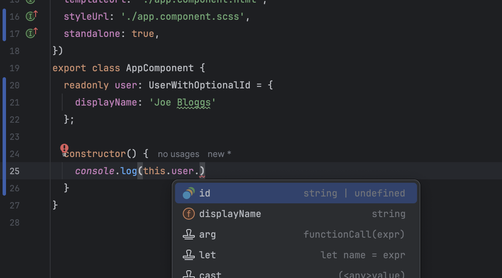
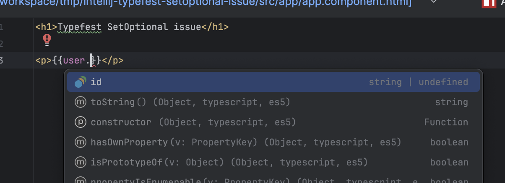
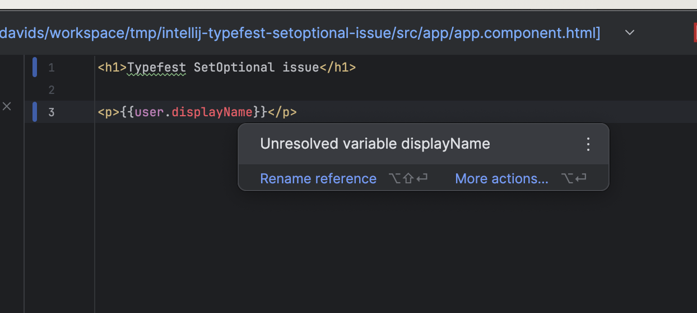

# Demo of bug

Typechecking in the HTML template is incorrect when using `SetOptional` from type-fest.

In the typescript file, the type is correct and all properties are available:

In the html file, only the optional properties are recognised by the IDE:

And valid properties are highlighted as erroneous:

